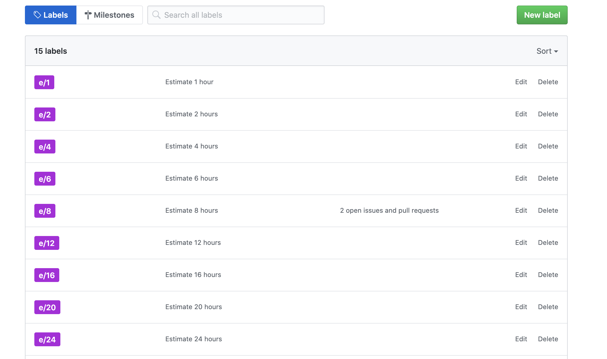

# Issues Hub
Is a [chrome extension](https://chrome.google.com/webstore/detail/issues-hub/gjpcbkmnpfnpmghmiohfcbhckigmloic) to add github issues the estimate capabilities.

# Steps to use:
 - Add labels to repositories with name `e/[num]`
 - Asign labels to issues
 - enjoy

# My labels

